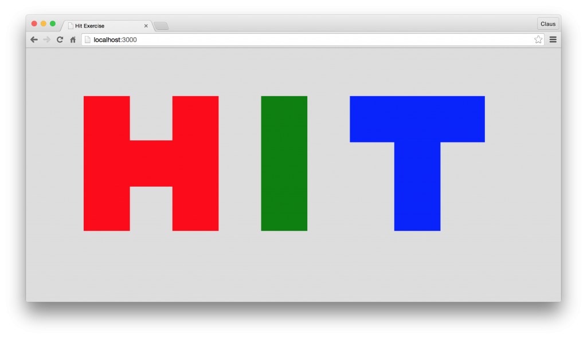

# 02 Exercise 3: HIT

Create an index.html page that will display the following.

This could be done in several ways, but here you should see it as a collection of squares with different background colors, and you should only use html and CSS.